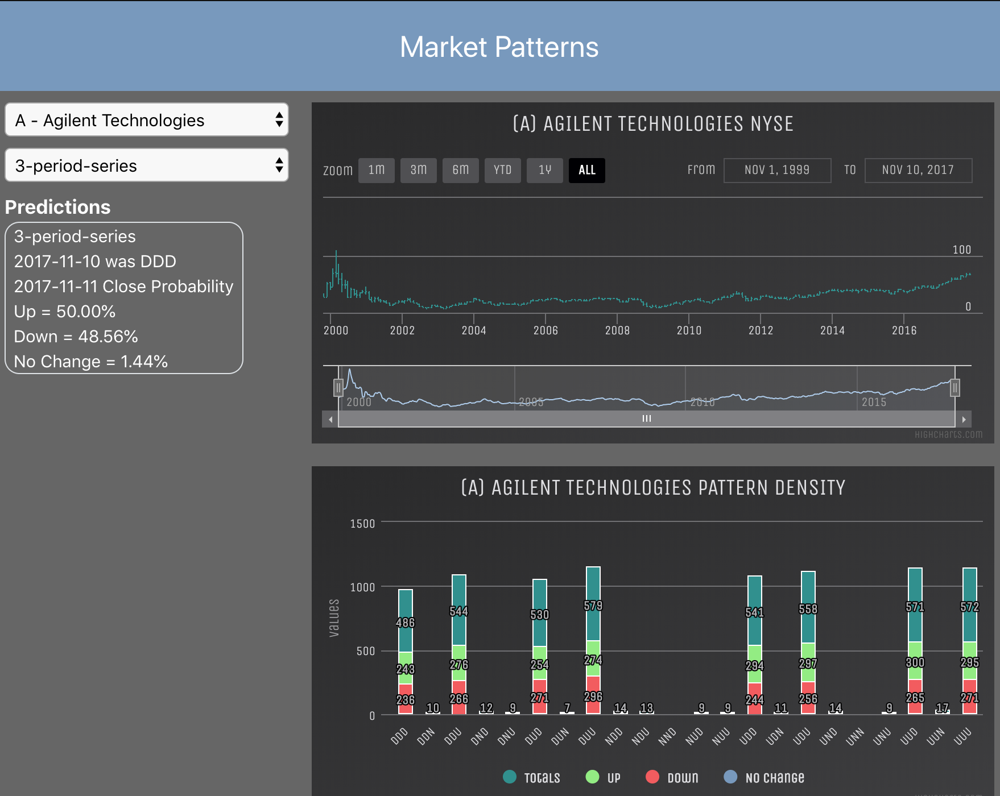

# market-patterns

Using the concept of [The Hidden Markov Model](https://en.wikipedia.org/wiki/Hidden_Markov_model), this project uses historical NYSE stock information to build patterns given a timeslice of periods.  

## Requirements

* [GoLang 1.11+ with Modules](https://golang.org/dl/)
* [Mongo 4+](https://www.mongodb.com/download-center/community)
* [Node.js and NPM](https://www.npmjs.com/get-npm)
* [ReactJS](https://www.codecademy.com/articles/react-setup-i)
* [react-device-detect](https://github.com/duskload/react-device-detect)
* [Highcharts](https://www.highcharts.com/docs/getting-started/install-from-npm)

## Program Arguments

## Makefiles

We've included makefiles to make things a bit easier to do:

| Make Target | Description |
|:------------|:------------|
|all| tests, builds and runs the application|
|build| builds to application|
|run| runs the application|
|trunc-load| executes the trunc and load using the stocks.zip and nyse-symb-name.csv files|
|test| executes go test on the application|
|cover| runs go cover outputting the results to coverage.out and coverage.html|
|clean| removes artifacts|

## Analytic Definitions

* A [Period](model/period.go) is defined for a company ticker symbol consisting of the Open, Close, High, and Low values of the stocks price for that day.  
* A [Series](model/series.go) describes the number of periods for calculating patterns.
* A [Pattern](model/pattern.go) describes the Up, Down, or No Change calculation between 2 periods for the length of the series.  Additionally, and more importantly, a pattern tracks the number of times that the next period after the pattern is either Up, Down, or No Change.
* A [Ticker](model/ticker.go) defines a company's ticker symbol and company name.

## Pattern Calculations

I'll use an illustration to describe how a pattern is generated for a given series over a time-slice of periods for a ticker.

For this illustration, we'll use the following IBM periods to calculate a Close pattern.

**Periods**

| Date     | Open | High | Low  | Close | Volume |
|---------:|-----:|-----:|-----:|------:|-------:|
|1962-01-08|6.2041|6.2041|6.0373|6.087  |655676  |
|1962-01-09|6.1208|6.2376|6.1208|6.1621 |592806  |
|1962-01-10|6.1707|6.2041|6.1707|6.1707 |359274  |
|1962-01-11|6.1875|6.2376|6.1875|6.2376 |386220  |
|1962-01-12|6.2543|6.2962|6.2543|6.2543 |529933  |

The first 4 periods above are used to determine the pattern with the last period used to calculate the next day's result.

**Patterns**

| Day 1    | Day 2    | Calculation     | Result |
|---------:|---------:|----------------:|-------:|
|1962-01-08|1962-01-09| 6.087 < 6.1621  | Up     |
|1962-01-09|1962-01-10| 6.1621 < 6.1707 | Up     |
|1962-01-10|1962-01-11| 6.1707 < 6.2376 | Up     |

The result for this sequence of periods is a pattern of 'UUU' or Up -> Up -> Up.

Next in the calculation step is to determine if the next period after the pattern is either Up, Down, or No Change. This is, again, just a comparison of the close price of 1962-01-11 and 1962-01-12 which is Up.  We iterate over the entire period time-slice to generate a total of the number of times that given the 'UUU' pattern, the next day's close prices is Up, Don, or No Change.

Click [here](output/ibm.md) for the results of IBM pattern generation.

## What You'll See

